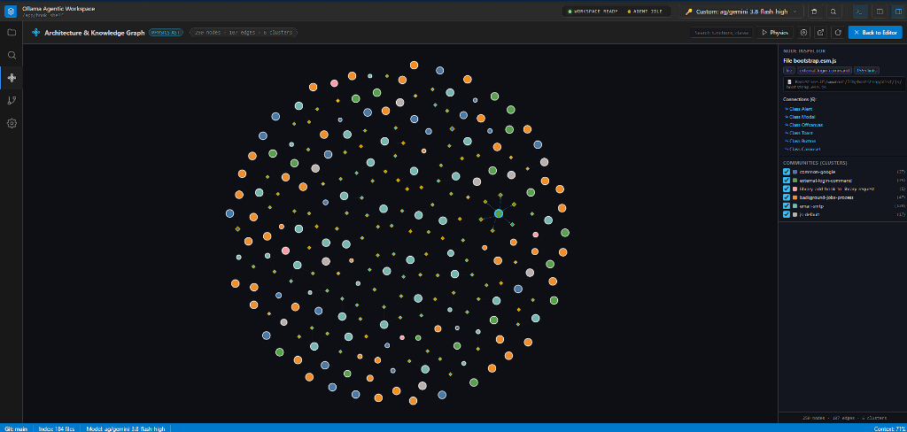
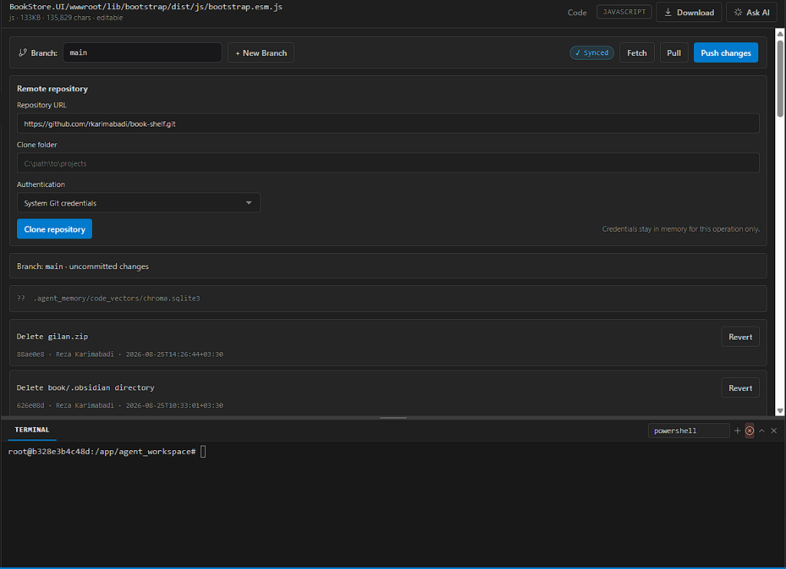

# CoderAI — Autonomous Agentic Coding Workspace

<p align="center">
  
</p>

<p align="center">
  
  
  
  
  
  
</p>

**CoderAI (Ollama Agentic Workspace)** is an enterprise-grade, local-first autonomous AI coding environment. Designed from the ground up for speed, privacy, and token efficiency, CoderAI combines **AST Physics Knowledge Graphs**, **Surgical Context Retrieval (LeanCTX)**, an **Integrated Visual Git Manager**, and **Autonomous Tool-Calling Agents** into a sleek, three-pane developer workspace.

Whether running 100% offline with local Ollama models or connected to cutting-edge cloud models (Gemini, DeepSeek, Claude, GPT-4o), CoderAI empowers you to inspect, architect, refactor, and build complex software without exhausting your context window or leaking proprietary code.

---

## ⚡ Key Highlights & Core Features

### 🧠 1. Architecture & Code Knowledge Graph (Physics AST)
Understanding large, multi-module codebases shouldn't require dumping hundreds of files into an LLM. CoderAI parses your workspace into an interactive, physics-driven **Abstract Syntax Tree (AST) Knowledge Graph**.

<p align="center">
  
</p>

- **Deep AST Structural Mapping**: Extracts classes, methods, functions, imports, callers, and dependencies across your entire repository.
- **Community Clustering**: Automatically identifies architectural domains (e.g., authentication, trading engine, background jobs, UI controllers) into distinct visual clusters.
- **Interactive Node Inspector**: Click on any node (file, class, or function) to inspect its connections, callers, import chains, and exact definitions in real time.
- **Direct Jump to Code**: Clicking any symbol node instantly opens the target file in the editor and scrolls directly to that function or class definition.
- **Physics Canvas**: Smooth zoom, drag, cluster filtering, and full-screen schematic view powered by an accelerated physics simulation.

---

### 📉 2. Radical Token Optimization & Context Reduction (Up to 80% Savings)
Traditional AI coding tools dump entire files into the prompt, rapidly exhausting token limits and inflating API costs. CoderAI uses **Graph-Augmented Retrieval (Graph-RAG)** and **LeanCTX** to pass only the exact code slices needed for the task.

| Feature | Naive AI Coding Tools | CoderAI Workspace |
| :--- | :--- | :--- |
| **Context Strategy** | Ingests entire raw files indiscriminately | Surgical subgraph slicing via AST Graph |
| **Token Usage** | 15,000 – 40,000+ tokens per query | **2,000 – 6,000 tokens** (70–80% reduction) |
| **Accuracy** | High hallucination due to context overload | Pinpoint accuracy with caller/dependency resolution |
| **Context Window** | Fills context window in 2–3 turns | Retains long-running multi-turn sessions cleanly |
| **Embedding Engine** | Cloud-dependent or missing | Local `nomic-embed-text` (768-dim) dense vector embeddings |

- **Surgical Graph Slicing**: When modifying a function, the agent queries the AST graph for its *impact radius* (only the direct callers and import references), eliminating redundant code.
- **LeanCTX Smart Reading**: Tools like `read_file` support targeted line ranges, outlines, and symbol definitions rather than reading thousands of lines into memory.
- **Dual Vector & Keyword RAG**: Combines local SQLite/Chroma dense vector embeddings (`nomic-embed-text`) with BM25 hybrid search for instant code retrieval.

---

### 🌿 3. Visual Git Manager & Safe Version Control
Never lose code or worry about an agent making unwanted modifications. CoderAI features a complete, visual Git management center with built-in safeguards.

<p align="center">
  
</p>

- **Automated AI Pre-Turn Checkpoints**: Before the agent executes code modifications, CoderAI automatically creates safe Git branch checkpoints. If you don't like the AI's changes, you can instantly revert.
- **Visual Commit Timeline & Instant Revert**: View real-time commit history with timestamps, author information, and one-click **Revert** buttons for rapid rollbacks.
- **Full Remote Repository Sync**: Clone remote Git repositories, switch branches, create new branches, fetch, pull, and push directly from the top toolbar.
- **Approval Gatekeeper**: Destructive operations (`rm`, `drop`, shell resets) and major file overwrites require explicit user review before execution.
- **Embedded xterm.js Terminal**: A real-time, hardware-accelerated terminal right beneath the Git interface supporting PowerShell, Command Prompt, and Bash.

---

### 🛠️ 4. Autonomous Agent Runtime & Tool Ecosystem
CoderAI runs an intelligent pair-programmer capable of autonomous problem solving:
- **Intelligent Tool Ecosystem**: 40+ specialized native tools including `replace_in_file`, `write_file`, `search_codebase`, `get_project_overview`, `run_command`, `check_file_diagnostics`, and Playwright-powered `navigate_web`.
- **Self-Correction & Diagnostics (LSP)**: After modifying files, the agent runs diagnostics to verify syntax, linting, and imports. If an error is detected, it self-corrects before finishing the turn.
- **Anti-Looping Circuit Breaker**: Advanced loop-detection algorithms prevent the agent from getting stuck in iterative exploration cycles, ensuring concise, complete answers.
- **Smart Tool Scoping**: Git tools and system commands are only exposed when relevant to the user's intent, preventing hallucinated operations.

---

### 🌐 5. First-Class RTL / LTR Bilingual Typography
Designed for seamless multilingual software development, CoderAI provides native support for right-to-left languages (Persian, Arabic) mixed with English code.

- **Intelligent Direction Detection**: Automatically detects language direction without being fooled by Latin code blocks or English identifiers.
- **Mixed-Language Precision (BiDi Isolation)**: When English technical terms, filenames, or function names are embedded inside Persian sentences, W3C `unicode-bidi: isolate;` ensures punctuation, brackets, colons, and numbers never scramble or flip.
- **Bidirectional Report Editor**: Markdown reports and analysis files (`.md`) rendered in the editor automatically switch to RTL with readable typography while keeping pure code LTR.

---

### 🔒 6. 100% Offline Privacy or Cloud Flexibility
- **Local Ollama First**: Run models like `llama3.1`, `gemma2`, `qwen2.5`, and `deepseek-coder` entirely offline on your GPU/CPU with complete data sovereignty.
- **Universal Custom API**: Connect to any OpenAI-compatible endpoint (Google Gemini, DeepSeek-V3/R1, Claude, GPT-4o) with custom headers, proxy discovery, and automated fallback models.
- **Persistent Memory Database**: Session turns, extracted architectural facts, and long-term project knowledge are persisted in local SQLite databases (`memory.db`).

---

## 🚀 Quick Start & Installation

### Option A: Portable Windows Executable (Zero Setup)
No Python installation or terminal commands required:
1. Go to the [GitHub Releases](https://github.com/mohamadreza1368/coderAI/releases) page.
2. Download `CoderAI_Workspace.exe`.
3. Run the executable and open `http://localhost:7864` in your browser.

### Option B: Run with Python
```bash
# 1. Clone repository
git clone https://github.com/mohamadreza1368/coderAI.git
cd coderAI

# 2. Install dependencies
pip install -r requirements.txt

# 3. Launch application
python main.py
```
Open [http://localhost:7864](http://localhost:7864) in your browser.

### Option C: Run with Docker Compose
```bash
docker compose up -d --build
```
CoderAI will be accessible at [http://localhost:7864](http://localhost:7864).

---

## ⌨️ Slash Commands (`/`)

Type `/` in the prompt composer to trigger high-powered engineering skills:
- `/plan`: Architect a multi-step plan before writing code.
- `/refactor`: Clean up code smells, improve readability, and optimize performance.
- `/test`: Generate comprehensive unit tests and run execution suites.
- `/review`: Perform security audits, detect SQL injections, and enforce best practices.
- `/git`: Review staged diffs, draft release notes, and commit changes.

---

## 📄 License

This project is licensed under the MIT License. See [LICENSE](LICENSE) for details.
